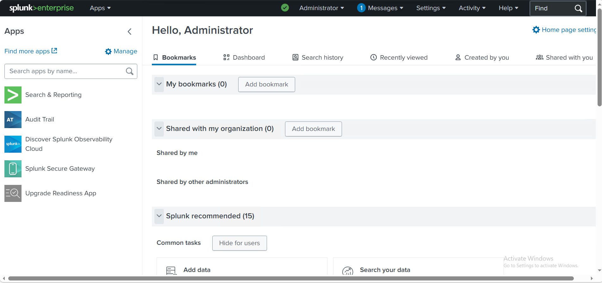
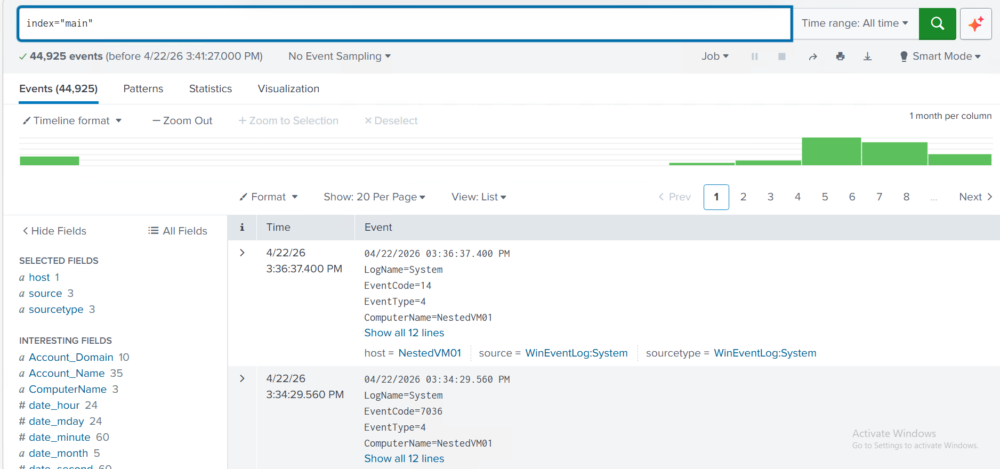
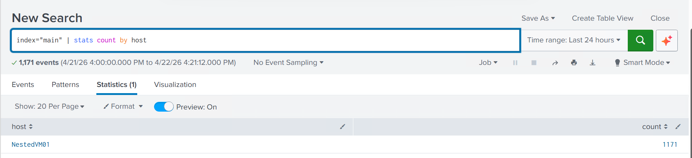
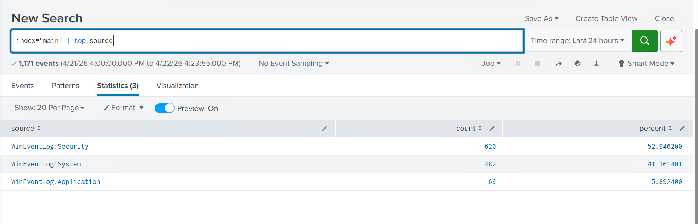

# Splunk SIEM Security Monitoring Lab

## Overview

This project demonstrates the deployment and use of Splunk Enterprise as a Security Information and Event Management (SIEM) solution within a virtual lab environment.

The objective was to collect Windows Event Logs, perform security monitoring, analyze system activity, and investigate security-related events using Splunk Search Processing Language (SPL).

---

## Environment

### Systems

- Windows Server
- Hyper-V Virtual Environment
- Splunk Enterprise 10.2.2

### Data Sources

- Windows Security Logs
- Windows System Logs
- Windows Application Logs

---

## Skills Demonstrated

- SIEM Administration
- Log Collection and Management
- Windows Event Monitoring
- Security Event Investigation
- Threat Detection
- Security Operations (SOC)
- SPL Query Development
- Event Analysis

---

## Splunk Searches Performed

### Count Events by Host

```spl
index="main" | stats count by host
```

Purpose:
- Identify event volume generated by each monitored host.

### Top Log Sources

```spl
index="main" | top source
```

Purpose:
- Determine the most active log sources.

### Failed Login Investigation

```spl
index="main" EventCode=4625
```

Purpose:
- Detect failed authentication attempts.
- Identify potentially suspicious login activity.

---

## Findings

### Host Activity

The monitored environment generated over 1,100 indexed events during testing.

### Log Sources

The primary sources included:

- WinEventLog:Security
- WinEventLog:System
- WinEventLog:Application

### Security Monitoring

Failed login events were successfully detected and analyzed using Windows Event ID 4625.

---

## Technologies Used

- Splunk Enterprise
- Windows Server
- Hyper-V
- Windows Event Logging
- Security Information and Event Management (SIEM)

---
## Demonstration Video

Watch the Splunk SIEM Security Monitoring Lab demonstration:

https://youtu.be/snG00WMnoSA
---

## Screenshots

### Splunk Dashboard


### Event Collection


### Statistics by Host


### Top Sources


---

## Key Learning Outcomes

- Deploying a SIEM platform
- Collecting and indexing Windows logs
- Performing log analysis
- Investigating security events
- Building foundational SOC analyst skills

---

## Disclaimer

All activities were conducted in a controlled educational lab environment for cybersecurity training and learning purposes only.
